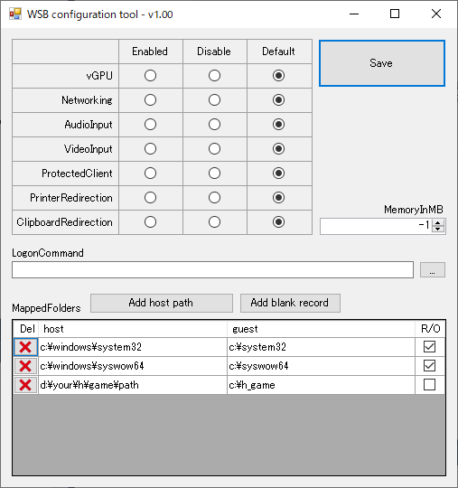

# mkwsb
Windows sandbox configuration creater

This repository contain 3 solutions.

## 1. GUI style

If you want to use GUI. you can use [the GUI configration tool](./releases).

- require .NET framework 2.0



## 2. PowerShell script

If you are professional PowerShell user. you can create a WSB configuration file using [the PowerShell script](./mkwsb.ps1).

example:

```ps
PS> .\mkwsb.ps1 -MappedFolders c:\path\to\host::c:\path\to\wsb

PS> .\mkwsb.ps1 -MappedFoldersReadonly c:\path\to\readonly

PS> .\mkwsb.ps1 -vGPU -Networking:$false -PrinterRedirection:$false -LogonCommand "shutdown.exe -t 0"
```

## 3. XML templete file

If you love XML format, you can create a WSB configuration file using [the XML template file :-)](./templete.wsb)
